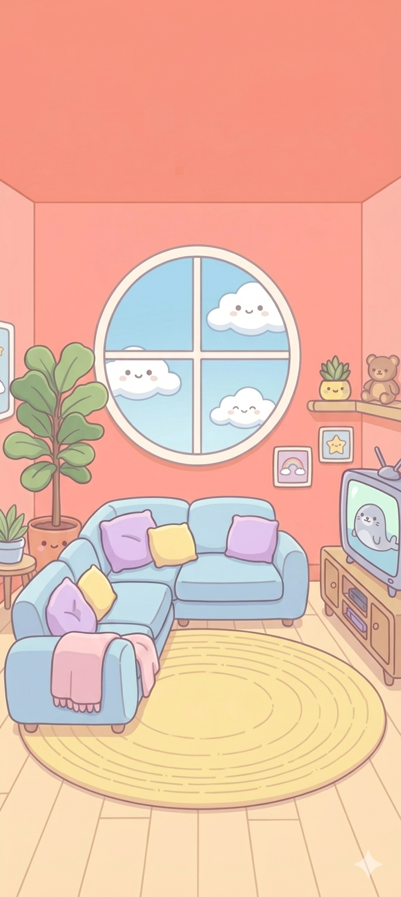
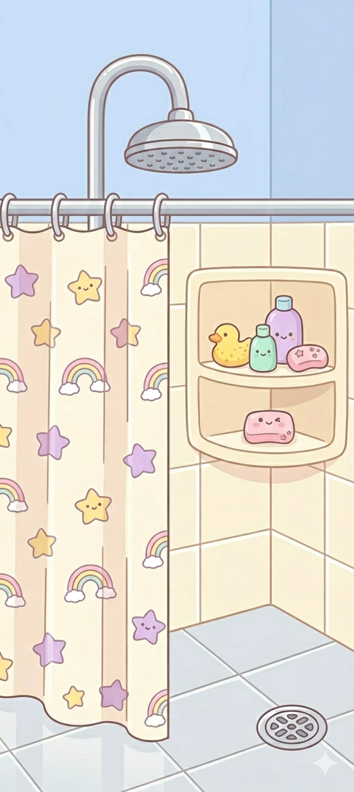
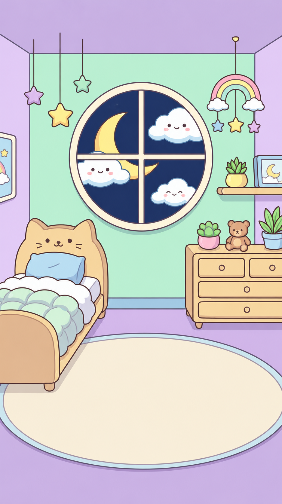
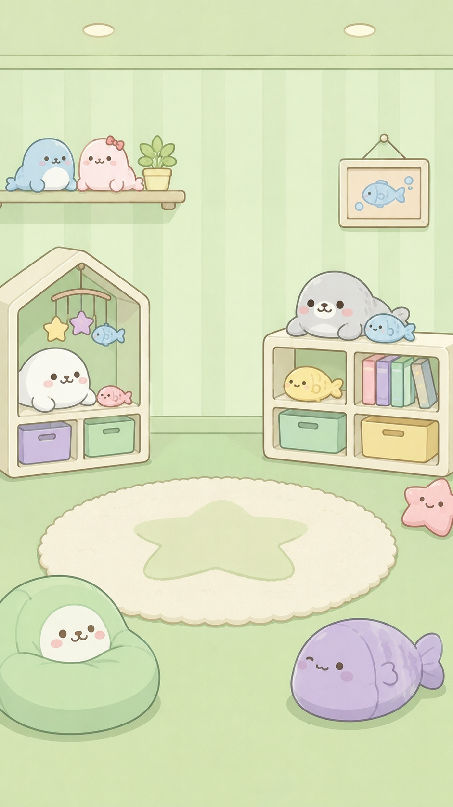

# Patroclo - Mascota Virtual 🦭

¡Bienvenido a **Patroclo**, tu nueva mascota virtual! Este proyecto es una aplicación de simulación interactiva desarrollada en Android Studio utilizando **Jetpack Compose** y **Firebase**.

## 🌟 Puntos Clave de la App

*   **Interacción en Tiempo Real:** Cuida de Patroclo satisfaciendo sus necesidades básicas.
*   **Gestión de Estados:**
    *   **Hambre:** Aliméntalo con salmón fresco para mantenerlo feliz.
    *   **Diversión:** Juega con él para que no se aburra.
    *   **Sueño:** Asegúrate de que descanse bien apagando la luz.
    *   **Salud/Higiene:** Mantén a Patroclo limpio dándole una ducha.
*   **Minijuegos:** Incluye juegos como "Pesca Equilibrada" para ganar recompensas y mejorar su estado.
*   **Sincronización con Firebase:** Los datos de tu mascota se guardan de forma segura en la nube.
*   **Efectos de Sonido y Música:** Experiencia inmersiva con música de fondo y efectos especiales (SFX).

## 📸 Escenarios de Juego

A continuación se muestran los diferentes lugares donde puedes interactuar con Patroclo:

### 1. Sala Principal (Main Game)
Es el centro de operaciones donde puedes ver el estado general de Patroclo.


### 2. Baño (Higiene)
Mantén a Patroclo reluciente usando la regadera y el jabón.


### 3. Dormitorio (Descanso)
Apaga las luces para que Patroclo pueda recuperar energías.


### 4. Sala de Diversión y Minijuegos
El lugar ideal para jugar y entretenerse.



---

## 🚀 Cómo Ejecutar la Aplicación

1.  **Clonar el repositorio:**
    ```bash
    git clone https://github.com/ItsTitann/MascotaVirtual-GAME.git
    ```
2.  **Abrir en Android Studio:**
    *   Asegúrate de tener la última versión de Android Studio (Ladybug o superior).
    *   Importa el proyecto y espera a que el Gradle termine de sincronizar.
3.  **Configurar Firebase (Opcional si ya está configurado):**
    *   El proyecto ya incluye un archivo `google-services.json`. Asegúrate de que tu consola de Firebase permita el acceso a la Realtime Database.
4.  **Ejecutar:**
    *   Conecta un dispositivo físico o usa un emulador.
    *   Presiona el botón **Run** (flecha verde).

## 🛠 Requisitos Mínimos

*   **Sistema Operativo:** Android 8.0 (API nivel 26) o superior.
*   **Memoria RAM:** 2GB (Recomendado 4GB para un rendimiento óptimo).
*   **Conexión a Internet:** Requerida para la sincronización de datos con Firebase.
*   **Android Studio:** Versión Jellyfish o superior.
*   **Kotlin:** 2.0+

---
Desarrollado con ❤️ para los amantes de las mascotas virtuales. ¡Disfruta cuidando a **Patroclo**!
